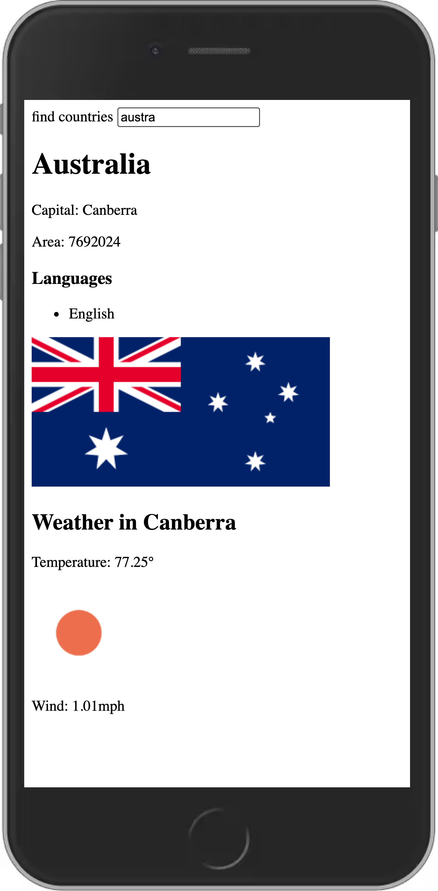
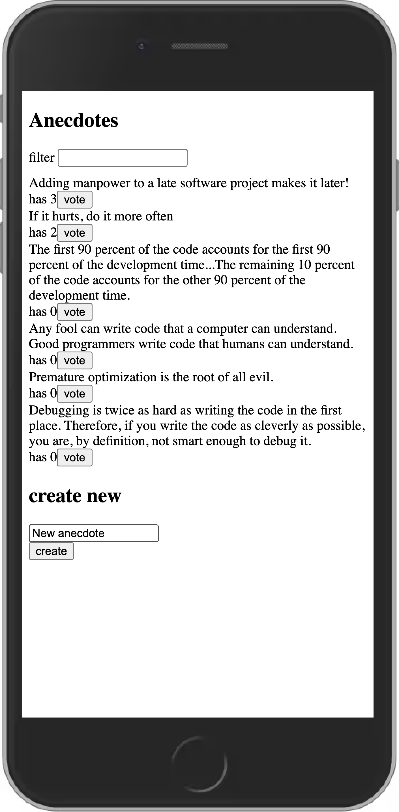

# [Full Stack Open](https://fullstackopen.com/en/)

### *Deep Dive Into Modern Web Development* 

### *University of Helsinki Department of Computer Science Course*

The course covers modern web application development with JavaScript. The main focus is building single page applciations with ReactJS that use REST APIs built with Node.js. The course covers testing, configuration and environment management, the use of databases for storing the application's data, amongst other things. 

### [Part 1 - Introduction to React](https://github.com/HenryWinters/full-stack-open-2021/tree/main/part1)

### [Part 2 - Communicating with server](https://github.com/HenryWinters/full-stack-open-2021/tree/main/part2)

### [Part 3 - Programming a server with NodeJS and Express](https://github.com/HenryWinters/full-stack-open-2021/tree/main/part3)

### [Part 4 - Testing Express servers, user administration](https://github.com/HenryWinters/full-stack-open-2021/tree/main/part4/blog-list)

### [Part 5 - Testing React Apps](https://github.com/HenryWinters/full-stack-open-2021/tree/main/part5/bloglist-frontend)

### [Part 6 - Advanced state management](https://github.com/HenryWinters/full-stack-open-2021/tree/main/part6)

This course consisted of many hands-on exercises and projects that we were to complete on our own. Here are a few of the most notable ones I completed as part of this course: 

### Blog App

Full stack application built with React, Node.js, Express, and MongoDB. Users can log in and post blogs. Blog post will add to blog feed and include blog details and like button. Token based authentication to allow only the user who created the blog to delete it. Robust testing with jest and end to end testing with cypress. 

[Front end repo link](https://github.com/HenryWinters/full-stack-open-2021/tree/main/part5/bloglist-frontend)

[Back end repo link](https://github.com/HenryWinters/full-stack-open-2021/tree/main/part4/blog-list)

### Phonebook App 

Full stack application built with React, Node.js, Express, and MongoDB. User can save contacts that will store in MongoDB. Contact list can be filtered. Deployed to Heroku. 

[Front end repo link](https://github.com/HenryWinters/full-stack-open-2021/tree/main/part2/phonebook)
[Back end repo link](https://github.com/HenryWinters/full-stack-open-part3)

### Countries App

Application to practice working with external REST APIs. App calls the RestCountries API to receive country data. Search bar will display list of countries. Clicking 'show' will show country details - name, capital, flag, etc. - and make a call to the OpenWeather api to give user the capital's current weather in real-time.  

[Repo link](https://github.com/HenryWinters/full-stack-open-2021/tree/main/part2/countries)

    
    
    

### Anecdotes App 

App built with React and Redux to practice managing state with Redux. User can add and vote on their favorite anecdotes. Anecdotes automatically sort by most votes. 

[Repo link](https://github.com/HenryWinters/full-stack-open-2021/tree/main/part6/redux-anecdotes)

